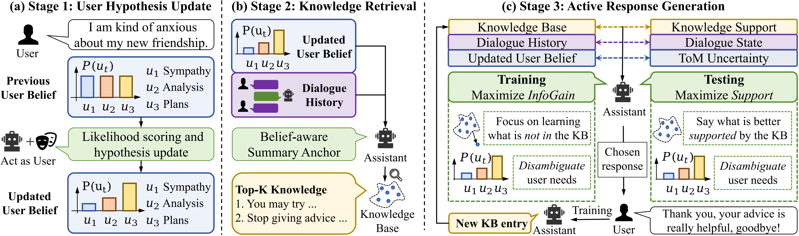

<div align="center">

# User-Aware Active Knowledge Acquisition for Emotional Support Dialogue

[](https://arxiv.org/abs/2605.29715)

*Mufan Xu, Kehai Chen, Jiahao Hu, Xinchao Xu, Muyun Yang, Tiejun Zhao, Min Zhang*



</div>

---

# UKA Dialogue Evaluation

This repository contains two automated dialogue-evaluation flows:

- Sentient-Eval style flow: `code/test_sentient_eval.py`
- ESConv flow: `code/test_extes.py`

The profile and benchmark data are stored under `code/profile/`.

## Setup

**Python ≥ 3.9 is required** (tested with Python 3.11). The codebase uses f-strings, type annotations, and other features unavailable in Python 3.8 or below.

Install the Python dependencies:

```bash
pip install -r requirements.txt
```

### Model requirements

The evaluation flow involves **three models**:

| Role | Description | Default configuration |
|------|-------------|----------------------|
| **Assistant (policy) model** | The model being evaluated — generates dialogue responses and needs logprobs for user modeling. | vLLM / OpenAI-compatible server on localhost:8000 (set via `LOCAL_LLM_CHAT_URL` / `LOCAL_LLM_COMPLETION_URL`) |
| **User simulator** | Plays the role of a patient/user in the dialogue, providing emotional feedback. | ESConv / ExTES: GPT-4o. Sentient Eval (Chinese): DeepSeek-V3 |
| **Critic model** | Judges user feedback or emotional change during memory updates and retry decisions. | **Same model as the user simulator** — configured via the same environment variables. ESConv / ExTES: GPT-4o. Sentient Eval (Chinese): DeepSeek-V3 |

> **Why vLLM for the assistant model?** The code needs `logprobs` from the model (see `active_response.py:118` and `active_response_extes.py:264`). Most closed-source API providers do not reliably expose token-level logprobs. A local vLLM server is recommended.

#### Assistant model (policy model)

The assistant model must serve an OpenAI-compatible chat/completions API with logprobs support. Place a vLLM instance on port 8000 or set the endpoints accordingly.

The model name passed as a command-line argument (e.g. `qwen-32b`) is prepended with `./` internally. Models listed in [`active_sampler.py:LOCAL_MODELS`](code/active_sampler.py#L11) are routed to the local endpoint; all others are routed to `REMOTE_LLM_CHAT_URL`.

> **Important:** The `LOCAL_MODELS` set in [`active_sampler.py:11-16`](code/active_sampler.py#L11) is hardcoded with specific model names (`./qwen-32b`, `./seed-36b`, `./gpt-120b`, `./qwen3-235b-a22b-instruct-2507`). If your vLLM instance is serving a different model, you must update this list — otherwise the code will route requests to the wrong endpoint.

#### User simulator & critic model

The user simulator and critic share the **same model and configuration**. Both use the OpenAI Python client and are configured via the same set of environment variables, defined in the `call_llm()` function in each flow's simulator file:

- **Chinese (Sentient Eval) flow**: [`simulator_response.py:24-33`](code/simulator_response.py#L24) — `call_llm()` (simulator). The critic call is elsewhere in the codebase but follows the same model configuration. Default: DeepSeek-V3 via `CHINESE_SIMULATOR_*` env vars.
- **English (ESConv / ExTES) flow**: [`simulator_response_extes.py:11-20`](code/simulator_response_extes.py#L11) — `call_llm()` (simulator). The critic call is elsewhere in the codebase but follows the same model configuration. Default: GPT-4o via `EXTES_SIMULATOR_*` env vars.

Common environment variables:

```bash
export POLICY_API_KEY="your-policy-api-key-or-EMPTY-for-a-local-server"
export LOCAL_LLM_CHAT_URL="http://0.0.0.0:8000/v1/chat/completions"
export LOCAL_LLM_COMPLETION_URL="http://0.0.0.0:8000/v1/completions"
export REMOTE_LLM_CHAT_URL="http://0.0.0.0:8000/v1/chat/completions"

export UKA_KB_ROOT="./code/kb"
export UKA_EMBEDDING_MODEL="google/embeddinggemma-300m"
```

Simulator environment variables:

> **⚠️ `SIMULATOR_API_KEY` is mandatory.** Without it (or its per-flow variant), the program will immediately exit with a `RuntimeError`.

```bash
export SIMULATOR_API_KEY="your-simulator-api-key"
export SIMULATOR_BASE_URL="https://your-openai-compatible-endpoint/v1"
export SIMULATOR_MODEL="your-simulator-model"
```

> **Note:** The English flow's simulator default URL (`EXTES_SIMULATOR_BASE_URL`) is set to a generic placeholder in [`simulator_response_extes.py:18`](code/simulator_response_extes.py#L18). You must set `EXTES_SIMULATOR_BASE_URL` or `SIMULATOR_BASE_URL` to your own OpenAI-compatible endpoint before running the English flow. The Chinese flow defaults to the public DashScope endpoint.

You can also override the simulator per flow:

```bash
export CHINESE_SIMULATOR_API_KEY="your-key"
export CHINESE_SIMULATOR_BASE_URL="https://dashscope.aliyuncs.com/compatible-mode/v1"
export CHINESE_SIMULATOR_MODEL="deepseek-v3"

export EXTES_SIMULATOR_API_KEY="your-key"
export EXTES_SIMULATOR_BASE_URL="https://your-openai-compatible-endpoint/v1"
export EXTES_SIMULATOR_MODEL="gpt-4o"
```

## Workflow: Training → Testing

The evaluation uses a two-phase process:

1. **Training** — runs a subset of the data to populate the ChromaDB knowledge base with dialogue principles and experience. No evaluation results are saved.
2. **Testing** — runs the remaining data against the trained knowledge base. Results are written to the output JSONL file.

Always run `training` first, then `testing`. If you skip training, the knowledge base will only contain the built-in seed entries.

## Run The Chinese Flow

From the repository root:

```bash
cd code
python test_sentient_eval.py <policy_model> <training|testing>
```

Example:

```bash
python test_sentient_eval.py qwen-32b testing
```

This flow loads `code/profile/simulator_profile_withfirsttalk.jsonl`, initializes the Chinese simulator, and writes testing results to:

```text
code/<policy_model>-uka-normal.jsonl
```

In `training` mode, the script updates the Chroma knowledge base but does not append session results to the output JSONL.

## Run The English Flow

From the repository root:

```bash
cd code
python test_extes.py <policy_model> <training|testing> <uka|principle> [esconv|extes]
```

The optional fourth argument selects the dataset (default: `esconv`):

| Dataset | Data source | Description |
|---------|-------------|-------------|
| `esconv` (default) | `code/profile/ESConv/*.jsonl` | Emotional Support Conversation dataset |
| `extes` | `code/profile/ExTES/*.parquet` | Extended Test Set for emotional support |

Examples:

```bash
python test_extes.py qwen-32b testing uka
python test_extes.py qwen-32b training principle
python test_extes.py qwen-32b testing uka extes
```

This flow loads data from:

- `code/profile/ESConv/train.jsonl` or `code/profile/ExTES/` for `training`
- `code/profile/ESConv/test.jsonl` or `code/profile/ExTES/` for `testing`

Testing results are written to:

```text
code/<policy_model>-<mode>-<dataset>-rebuttal.jsonl
```

The `uka` mode uses user modeling plus knowledge retrieval. The `principle` mode runs a critic-free retry loop during training and stores reusable dialogue principles in the knowledge base.

## Analyze Results

After a testing run:

```bash
cd code
python analyze_score.py <result_file.jsonl>
```

Example:

```bash
python analyze_score.py qwen-32b-uka-esconv.jsonl
```

## Notes

### Embedding model

The default embedding model is [`google/embeddinggemma-300m`](https://huggingface.co/google/embeddinggemma-300m), downloaded automatically from HuggingFace on first use. To use a different model, set:

```bash
export UKA_EMBEDDING_MODEL="/path/to/your/embedding/model"
```

### Thread safety in training mode

`test_sentient_eval.py` and `test_extes.py` use `ThreadPoolExecutor` with 4 workers. In **training** mode, all workers share the same ChromaDB (SQLite) knowledge base instance. Concurrent writes may trigger `"database is locked"` errors. If you encounter this, reduce `MAX_WORKERS` to 1 (near the top of each test script) or add a `threading.Lock` around `kb.add_documents()` calls in [`active_response.py:469`](code/active_response.py#L469) and [`active_response_extes.py:764`](code/active_response_extes.py#L764).

### Model name format

Model names passed on the command line should **not** include the `./` prefix — it is added automatically in [`active_response.py:42`](code/active_response.py#L42) and [`active_response_extes.py:75`](code/active_response_extes.py#L75). For example, pass `qwen-32b`, not `./qwen-32b`.

### Data files

| File | Lines | Purpose |
|------|-------|---------|
| `code/profile/simulator_profile_withfirsttalk.jsonl` | 100 | Chinese Sentient Eval profiles (with first-turn utterances) |
| `code/profile/ESConv/train.jsonl` | 910 | ESConv training sessions |
| `code/profile/ESConv/test.jsonl` | 195 | ESConv testing sessions |
| `code/profile/ExTES/*.parquet` | — | Used when running `test_extes.py` with `extes` dataset; see [Run The English Flow](#run-the-english-flow) |

### Required vs optional environment variables

| Variable | Required? | Default |
|----------|-----------|---------|
| `POLICY_API_KEY` | Yes (set to `EMPTY` for local servers) | `EMPTY` |
| `LOCAL_LLM_CHAT_URL` | Yes | `http://0.0.0.0:8000/v1/chat/completions` |
| `SIMULATOR_API_KEY` (or `CHINESE_SIMULATOR_API_KEY` / `EXTES_SIMULATOR_API_KEY`) | **Yes** — program raises `RuntimeError` if missing | — |
| `SIMULATOR_BASE_URL` (or per-flow variant) | Yes (OpenAI-compatible endpoint) | Chinese: `dashscope.aliyuncs.com/compatible-mode/v1`; ESConv: set via `EXTES_SIMULATOR_BASE_URL` / `SIMULATOR_BASE_URL` |
| `SIMULATOR_MODEL` (or per-flow variant) | Yes | Chinese: `deepseek-v3`; ESConv: `gpt-4o` |
| `UKA_EMBEDDING_MODEL` | No | `google/embeddinggemma-300m` |
| `UKA_KB_ROOT` | No | `./code/kb` |
